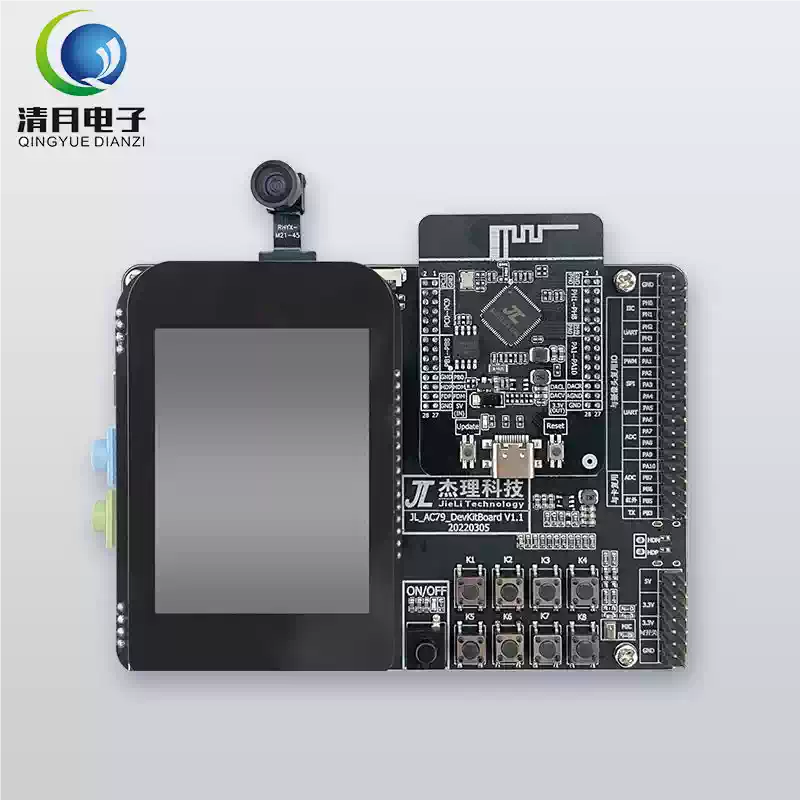
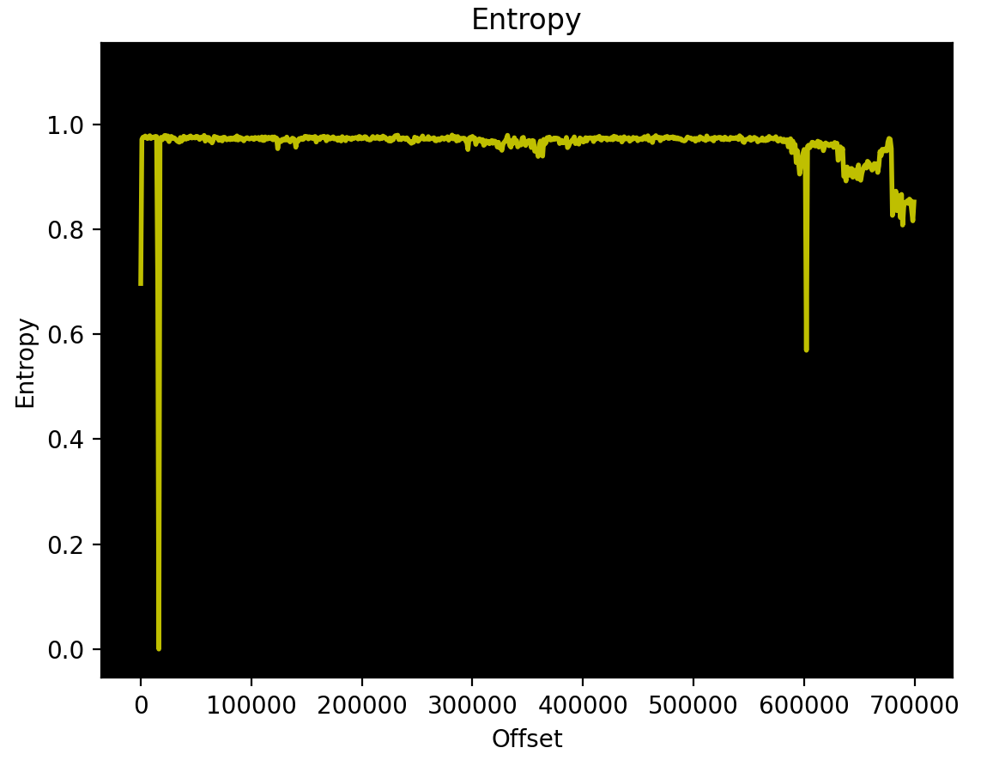

# M-VAVE FM1 & M-UPGRADE Analysis & MIDI SysEx Protocol Documentation

This document contains technical research, hardware details, and reverse-engineering results for the **M-VAVE FM1** synthesizer (powered by the **JieLi AC791N** processor) and the `M-UPGRADE-FM1.app` (macOS) utility.

---

## 1. Custom & Alternative Firmwares

Community-developed custom firmwares, mods, and experimental firmware projects for the M-VAVE FM-1, organized by category:

### 1.1. Sound, Synthesizer & Groovebox Firmwares

1. **[Felucca by hugelton](https://github.com/hugelton/Felucca) ([Web Installer](https://hugelton.github.io/Felucca/) | [Web Editor](https://hugelton.github.io/Felucca/webapp/editor/)):**
   * **License:** Open Source (GPL-3.0-only).
   * **Synthesizer Engines:** 9 distinct sound engines including **ANALOG** (virtual analog, 2 osc, PWM, resonant LPF), **DIGITAL** (4-op FM, 8 algorithms, feedback), **PHASE** (phase distortion), **LOFI** (chiptune, 4-bit wave RAM), **SAMPLE** (multisampled instruments + user slots), **VOICE** (formant/vocal osc), **TRIO** (3 osc with ring mod/sync), **WHEEL** (tonewheel organ with drawbars & rotary speaker), and **GRAIN** (granular textures).
   * **Architecture & Features:** 4 tracks (3 synth parts + 1 GM drum track, 8 shared voices), 64-step sequencer per track with chords/ties/slides and live loop recording, per-track SLICER (16-step tempo-synced gate/stutter), effects (distortion, chorus, delay, reverb sends, master limiter), scales & white-key quantization, and web editor.
   * **Installation:** Direct web installer via WebMIDI in Chrome/Edge over standard USB-C cable (no extra hardware needed; stock updater restores official firmware).

2. **[baud girl Custom Firmware Mod](https://baudgirl.com/):**
   * **License:** Closed Source.
   * **Features:** Comprehensive overhaul and reimagining of the stock firmware ergonomics and controls. Adds Virtual Analog (VA) synthesizer engines and a 64-step sequencer.
   * **Installation:** Web-based browser installer in a couple of clicks via WebMIDI.

3. **[Lunar Modulator by ip2k](https://github.com/ip2k/lunar-modulator):**
   * **License:** Open Source (MIT).
   * **Status:** Research / bench stage.
   * **Features:** *Intergalactic Modulation Station* — alternative firmware based on Mutable Instruments synthesizer engines, a Movy-style sequencer, and an in-browser virtual FM-1 emulator/simulator.

4. **[Groove OS](https://www.groove-os.com/) ([Web Emulator](https://www.groove-os.com/emu)):**
   * **License:** Commercial / Proprietary ($29).
   * **Concept:** Transforms the FM-1 into a standalone multitrack groovebox without needing any external equipment.
   * **Features:** Up to 8 independent tracks (drums, bass, chords, leads) with independent loop lengths (1 to 8 bars) for evolving polyrhythmic structures, dual sound engine (native 6-op FM + Virtual Analog with ladder filter), up to 20 voices of polyphony (12 FM + 8 VA, max 6 for drums), 64-step sequencer with parameter locks (p-locks), live stage view, curated sound packs, and DX7 SysEx patch reception.
   * **Installation:** Browser-based USB installer via WebMIDI in Chrome/Edge (~2 minutes).

5. **[SLOOP by isod89](https://github.com/isod89/sloop-fm1) ([Web Installer](https://isod89.github.io/sloop-fm1/) | [Web Editor](https://isod89.github.io/sloop-fm1/webapp/editor/)):**
   * **License:** Open Source (GPL-3.0). Based on Felucca by Hügelton Instruments.
   * **Concept:** Live performance groovebox firmware designed for any music style without mandatory presets or fixed patterns.
   * **Features:** 4 tracks (3 synth tracks + 1 drum machine with 16 sounds across the white keys), 9 synthesis engines, 68 sounds, 37 drum kits, custom sample support, and live-playable song mode. Features USB stereo audio input (class-compliant recording directly into DAWs without drivers), 3.5 mm TRS MIDI IN keyboard input, MIDI clock in/sync, button and note LED illumination modes for dark environments, sample chopping/fitting, and a web editor with full backup/restore.
   * **Installation:** Browser-based installer via WebMIDI in Chrome/Edge, with easy rollback to M-VAVE stock V15.

6. **[FoMni-1 by charlesvestal](https://github.com/charlesvestal/fm1-fomni) ([Web Installer](https://charlesvestal.github.io/fm1-fomni/)):**
   * **License:** Open Source (GPL-3.0).
   * **Concept:** Suzuki Omnichord-inspired chord harp firmware for the FM-1.
   * **Features:** Strum chords across the white keys like a harp strumplate, select chord roots and types on the black keys, integrated rhythmic accompaniment and arpeggiator modes.
   * **Installation:** Browser WebMIDI installer via USB.

7. **[ChoralRoot FM-1 by Quixotic7](https://github.com/Quixotic7/ChoralRootFM1) ([Web Installer](https://quixotic7.github.io/ChoralRootFM1/) | [Web Emulator](https://quixotic7.github.io/ChoralRootFM1/emu/)):**
   * **License:** Open Source (GPL-3.0). Based on Felucca (engines/platform) and ChoralRoot (Monome grid chord engine).
   * **Concept:** Telepathic Orchid / Monome-style chord performance instrument.
   * **Features:** Two-handed chord shaping (one hand selects roots, the other shapes voicings), custom key modes, performance bass line, built-in looper, full color UI, and browser sound emulator.
   * **Installation:** Browser WebMIDI installer via USB.

8. **[Melodee by keremimo](https://github.com/keremimo/melodee) ([Web Installer](https://keremimo.github.io/melodee/) | [Web Editor](https://keremimo.github.io/melodee/webapp/editor/)):**
   * **License:** Open Source (GPL-3.0-only). Modified build based on Felucca.
   * **Features:**
     * **Prophet-5 Engine (New in 0.13):** Native **Sequential Prophet-5 Rev 4** engine replacing ANALOG — two oscillators with hard sync, Poly-Mod, LFO/noise wheel modulation, selectable SSI (Rev 1/2) and Curtis (Rev 3) 4-pole low-pass filters, separate filter/amp envelopes, Vintage knob, glide, unison, and 5 voices per track. Includes **all 200 programs** of Sequential's v1.03 factory bank (128 native user slots P001–P128), 16 device parameter pages, and `.syx` program/bank import and export in the web editor.
     * **Casio CZ-1 Phase Distortion:** Authentic CZ-1 engine with 64 original CZ-1 factory preset tones, 8 CZ device banks with `.syx` import/export, and 38 dedicated editing pages.
     * **FM6 & Microtonal Scales:** 64 DX7/FM6 slots with direct SysEx bank dump support, 70 microtonal tunings across equal divisions, just intonation, historical temperaments, and maqam models.
     * **Advanced Sequencing:** Single unified note editor (`SEQ > NOTES`), reversible timing quantization (`QNT`), and 1,024 recorded notes across 32 pattern banks.
   * **Installation:** Browser WebMIDI installer with built-in backup before installation.

9. **[FM1 Quest by hericdk](https://github.com/hericdk/fm1-quest) ([Web Installer](https://hericdk.github.io/fm1-quest/webapp/installer/) | [Web Emulator](https://hericdk.github.io/fm1-quest/emulator/)):**
   * **License:** Open Source (GPL-3.0-only). Built upon the SLOOP groovebox core.
   * **Concept:** Fantasy RPG sidescroller interface for the groovebox: tracks are represented as party heroes, sequence steps are attacks, BPM drives party walk speed, scales dictate biomes, and recording loops triggers boss fights.
   * **Installation:** Browser WebMIDI installer via USB.

10. **[GHOULBOX by Jason Persinger](https://github.com/jasonpersinger/ghoulbox-fm1-dungeon-synth) ([Web Installer](https://jasonpersinger.github.io/ghoulbox-fm1-dungeon-synth/)):**
    * **License:** Open Source. Based on Felucca.
    * **Concept:** Dungeon synth, dark ambient, and fantasy music groovebox firmware.
    * **Features:** Cathedral-sized HALL reverb, worn-cassette TAPE effect, dedicated hurdy-gurdy engine with tunable drones and buzzing trompette, and 36 dungeon sounds (crypt pads, monk choirs, lutes, organs) with an old-school RPG UI and skull boot screen.
    * **Installation:** Browser WebMIDI installer via USB with full backup feature before flashing.

11. **[Jangada by zednaked](https://github.com/zednaked/jangada) ([Web Installer](https://zednaked.github.io/jangada/) | [Web Studio](https://zednaked.github.io/jangada/webapp/studio/)):**
    * **License:** Open Source. Based on Felucca.
    * **Concept:** Dark, industrial, Brazilian-accented groovebox firmware.
    * **Features:** 10 sound engines (including 6-op FM and superwave analog), 4 tracks, modulation matrix, ratchets, drone holding/evolving modes, and dedicated custom drum kits.
    * **Installation:** Browser WebMIDI installer via USB.

12. **[sloopDX by zvenson](https://github.com/zvenson/dxsloop) ([Website & Web Installer](https://dx7.designburgapps.com/) | [Web Editor](https://dx7.designburgapps.com/webapp/editor/) | [Cheat Sheet PDF](https://dx7.designburgapps.com/sloopdx-cheat-sheet.pdf)):**
    * **License:** Open Source (GPL-3.0-only). Built upon SLOOP (isod89), Felucca (Leo Kuroshita), and the `msfa` 6-operator DX7 core of Dexed (Apache-2.0).
    * **Concept:** SLOOP's live groovebox workflow merged with an authentic Yamaha DX7 engine and a fully programmable FM drum machine.
    * **Features:**
      * **6-Operator FM Engine:** Complete 32-algorithm DX7 engine ported directly from Dexed's `msfa` (99% sample-identical to Dexed), featuring full envelope scaling, keyboard level/rate scaling, LFO, and feedback.
      * **Cutoff & Resonance Filter:** Dedicated resonant low-pass filter (CUT and RESO on Knobs 1 & 2) placed behind every DX7 voice, modulatable via envelope and LFO.
      * **On-Device Voice Editing:** Full voice programming on the FM-1 hardware with parameter lists, visual operator box diagrams, and operator solo/mute auditioning, backed by a companion web editor.
      * **256 Sysex Voices:** 8 banks of 32 voices loaded directly from standard DX7 `.syx` bulk dumps (4104 bytes), supplemented with 20 factory modern patches (DEEP SUB, 808 SUB, REESE).
      * **Programmable 16×8 FM Drums:** 16 distinct FM drum sounds across 5 kits (`DX KIT`, `808 FM`, `ELECTRO`, `METAL`, `MY KIT`). Each sound provides 8 on-device macro controls (TUNE, DECAY, SWEEP, BRIGHT, NOISE, LEVEL, PAN, CHOKE) plus a dedicated reverb send, parameter locks per step, kit randomization dice, and kit export/import via `.syx`.
      * **OMNI Chord Harp Mode:** Turn any synth track into an Omnichord-like instrument (black keys trigger chords like F, C, G, Dm, Am, Em, G7, E7, D7, Bb, A7, while white keys act as 16 strum strings; bass tracks can follow chords via `FLW`).
      * **Sequencer & Effects:** Up to 128 steps per track (256 steps shared dynamically across tracks), dedicated per-effect pages (SENDS, DIST with soft/hard/fuzz/crush, CHORUS, DELAY, REVERB), USB audio streaming, and live punch-in FX.
    * **Installation:** Browser WebMIDI installer via USB directly from the project page.

13. **[X0X by Charles Vestal](https://github.com/charlesvestal/fm1-x0x) ([Web Installer](https://charlesvestal.github.io/fm1-x0x/install/) | [Web Emulator](https://charlesvestal.github.io/fm1-x0x/emu/) | [Manual](https://charlesvestal.github.io/fm1-x0x/manual/)):**
    * **License:** Open Source. Based on Felucca.
    * **Concept:** Propellerhead ReBirth-inspired techno/acid groovebox machine.
    * **Features:** TR-909, TR-808, two TB-303 synths with an integrated acid line generator, and a breakbeat player all playing simultaneously; includes automation, shared reverb and tape delay sends, and a master compressor.
    * **Installation:** Browser WebMIDI installer via USB (with stock restore option).

14. **[FiMba-1 by J. Adam Sowers (jadamsowers)](https://github.com/jadamsowers/fm1-fimba) ([Web Installer & Emulator](https://jadamsowers.github.io/fm1-fimba/)):**
    * **License:** Open Source (GPL-3.0-only).
    * **Concept:** Thumb piano / kalimba / mbira physical modeling synthesizer firmware for the FM-1.
    * **Features:**
      * **Physical Modeling Engine:** Detailed kalimba acoustic simulation running at 44.1 kHz, featuring modeled tines (material hardness, decay, tone, worn character, tuning, release), resonator bodies (box, gourd, board, buzzers, wah resonance), and built-in effects (space reverb/delay, lo-fi/tape color, chorus, filter, and granular cloud engine).
      * **Keyboard & Key Layouts:** Traditional kalimba *Tine* layout (lowest C4 tine in the center, alternating outwards across white keys) or chromatic *Keyboard* layout. Black keys configurable for thumb-roll chord accompaniment, sharps, or performance modifiers (mute, sound hole covering, freeze, octave shift).
      * **Built-in Sequencer/Arpeggiator:** Mbira pattern generator over chords and live playing.
      * **WebAssembly Browser Emulator:** Complete C sound engine and UI compiled to WebAssembly running in-browser with Web MIDI and preset saving.
    * **Installation:** Browser WebMIDI installer via USB directly from the project page.

15. **[zp12 by Sven Trogus (zvenson)](https://github.com/zvenson/zp12) ([Web Installer & Homepage](https://zp12.designburgapps.com/)):**
    * **License:** Open Source (GPL-3.0-only).
    * **Concept:** Authentic 1980s-style 12-bit sampling drum machine firmware for the FM-1.
    * **Features:**
      * **Lo-Fi 12-Bit Sound Engine:** 32 pads across 4 banks running at 26.04 kHz (or 27.5 kHz). Samples are pitched via pure playback rate skipping without interpolation for authentic gritty 80s aliasing and grain.
      * **8 Filtered Channels:** Independent channel playback where new hits cut previous ones. Channels 1–2 feature a resonant 4-pole low-pass filter closing with decay, channels 3–6 have fixed filters, and knobs act as channel faders.
      * **Performance & Sequencing:** 11 loops triggered on black keys, 4 chained songs, real-time recording with auto-correct and 16-step grid editing, classic MPC-style swing (50–71%), and 4 punch-in FX (beat repeat/roll, reverse, tape stop).
      * **Browser Sample Dropper:** In-browser tool to drop custom user WAVs onto pads and transmit them directly to flash over WebMIDI.
    * **Installation:** Web-based browser installer via WebMIDI in Chrome/Edge.

16. **[REDACTED by DJ Redacted](https://fm1-redacted-installer.xrhetor.chatgpt.site/):**
    * **License:** Open Source (GPL-3.0). Built on Felucca by Hügelton Instruments.
    * **Concept:** Experimental dark, fractured lo-fi four-track groovebox firmware (`PULSE` · `VOLTAGE` · `STATIC` · `GHOST`).
    * **Features:**
      * **Four Track Engines:** Four distinct sound layers chosen via `ALGORITHM`.
      * **Real-Time Track Shapers:** Four top knobs mapped to dynamic performance parameters: `FRACTURE`, `STATIC`, `CHANCE`, and `MUTATE`.
      * **Startup Artwork:** Custom broken vinyl record splash screen.
    * **Installation:** Browser WebMIDI installer via USB directly from the project page.

17. **[Hortator by DEADACTIVE](https://github.com/DeadActive/hortator) ([Web Emulator & Player](https://deadactive.github.io/hortator/)):**
    * **License:** Open Source (GPL-3.0). Built on Felucca.
    * **Concept:** 8-track drum machine firmware.
    * **Features:** TR-808, TR-909 and Mutable Instruments Plaits drum models, user samples, Mutable Instruments Grids generative rhythm algorithm, pumping master compressor, and acoustic resonators.
    * **Installation:** Browser WebMIDI installer via USB.

18. **[ORBIT by dspaudio](https://github.com/dspaudio/orbit) ([Web Emulator](https://dspaudio.github.io/orbit-web-emu/)):**
    * **License:** Open Source (GPL-3.0). Based on SLOOP.
    * **Concept:** Groovebox with visual aesthetic and screen interfaces inspired by the Teenage Engineering OP-1.
    * **Features:** Integrated sample manipulation tools and an event tape mechanism for dynamically shifting and rearranging what the 4 tracks play.
    * **Installation:** Browser WebMIDI installer via USB.

19. **[AMB-1 by Charles Vestal](https://github.com/charlesvestal/fm1-amb) ([Web Installer & Emulator](https://charlesvestal.github.io/fm1-amb/) | [Manual](https://charlesvestal.github.io/fm1-amb/)):**
    * **License:** Open Source (GPL-3.0).
    * **Concept:** Generative ambient synthesizer machine inspired by Brian Eno's *Music for Airports*.
    * **Features:** Self-generating playback immediately from power-on, unsynced tape loops of unequal lengths, gliding bass lines, and generative Euclidean percussion patterns.
    * **Installation:** Browser WebMIDI installer via USB.

20. **[April OS by beashoko](https://github.com/beashoko/april-os) ([Web Installer](https://beashoko.github.io/april-os/)):**
    * **License:** Open Source. Based on Felucca.
    * **Concept:** Dedicated sampling-focused groovebox firmware.
    * **Features:** 32 sample slots (up to 3 seconds each), 8-track sequencer, built-in sample slice and loop editor, direct audio recording using a connected smartphone or computer microphone.
    * **Installation:** Browser WebMIDI installer via USB.

21. **[NoteSorcery by catacombius](https://github.com/catacombius/NoteSorcery):**
    * **License:** Open Source (GPL-3.0). Built on SLOOP.
    * **Concept:** OP-1-style 8-track groovebox firmware.
    * **Features:** Live USB audio sampling, project export straight to Ableton Live sets, companion Android controller application.
    * **Installation:** Build and flash via CLI toolchain.

22. **[FM1 Move by Nicodesy06](https://github.com/Nicodesy06/FM1-MOVE) ([Web Simulator](https://nicodesy06.github.io/FM1-MOVE/sim/) | [Manual](https://nicodesy06.github.io/FM1-MOVE/manual/)):**
    * **License:** Open Source (GPL-3.0).
    * **Concept:** 8-track live groovebox firmware inspired by the Ableton Move workflow.
    * **Features:** Performance-oriented pad and sequence navigation, parameter locks, scene chaining, and an interactive in-browser simulator.
    * **Installation:** Browser WebMIDI installer via USB.

23. **[FuMi-1 by cartesive](https://github.com/cartesive/fumi-1) ([Web Installer & Emulator](https://cartesive.github.io/fumi-1/)):**
    * **License:** Open Source (GPL-3.0). Fork of FoMni.
    * **Concept:** Traditional Japanese Shigin accompaniment synthesizer inspired by Suikohsha's ST-50.
    * **Features:** Authentic Koto, Sho, Shakuhachi, and Taiko voices tuned to the historical ST-50 just intonation scale system.
    * **Installation:** Browser WebMIDI installer via USB.

24. **[CTL-1 by Charles Vestal](https://github.com/charlesvestal/fm1-ctl) ([Web Installer](https://charlesvestal.github.io/fm1-ctl/)):**
    * **License:** Open Source (GPL-3.0).
    * **Concept:** Dedicated MIDI master controller firmware for the FM-1.
    * **Features:** Turns the FM-1's keys and knobs into a multi-channel USB/TRS MIDI controller while providing internal General MIDI sounds for standalone monitoring.
    * **Installation:** Browser WebMIDI installer via USB.

25. **[fm1-chord by math0ne](https://github.com/math0ne/fm1-chord):**
    * **License:** Open Source (GPL-3.0). Built on Felucca.
    * **Concept:** Chord composition tool, chord sequencer, rhythm accompanist, and ear-training aid.
    * **Installation:** Python installation script via USB MIDI.

26. **[WaveLoop FM-1 by ELI7VH](https://github.com/ELI7VH/Felucca) ([Web Installer](https://eli7vh.github.io/Felucca/)):**
    * **License:** Open Source (GPL-3.0). Based on Felucca.
    * **Concept:** Performance firmware specifically mapped for external control via Arturia MiniLab 3.
    * **Features:** Dedicated track fader mappings, follow-the-track encoder integration, DJ filter mode, and momentary punch-in FX pad triggers.
    * **Installation:** Browser WebMIDI installer via USB.

27. **[Rainbow mode by joshbartlettband-web](https://github.com/joshbartlettband-web/felucca-rainbow) ([Web Installer & Emulator](https://joshbartlettband-web.github.io/felucca-rainbow/)):**
    * **License:** Open Source (GPL-3.0). Based on Felucca.
    * **Concept:** Children's musical exploration instrument with rainbow color-coded keys, 40 animal sound effects and rhythms, safe volume limiter, and access to the complete Felucca engine via secret key combination.
    * **Installation:** Browser WebMIDI installer via USB.

28. **[PurpleMonkey FM-1 by Quixotic7](https://github.com/Quixotic7/PurpleMonkeyFM1) ([Web Emulator](https://quixotic7.github.io/PurpleMonkeyFM1/emu/)):**
    * **License:** Open Source (GPL-3.0).
    * **Concept:** Simplified toddler music instrument featuring a 5-note pentatonic scale, backing drum beats, and zero menus.
    * **Installation:** Browser WebMIDI installer via USB.

29. **[SLOOP ALG by shaw-core](https://github.com/shaw-core/Sloop_ALG02):**
    * **License:** Open Source. Based on SLOOP.
    * **Concept:** Experimental synthesis expansion fork adding Karplus-Strong string synthesis, plucked physical models, additive synthesis, DX7, and VA engines.
    * **Installation:** Web installer and companion editor.

30. **[FM-1 B-Boy Edition by friendsmakenoise-prog](https://github.com/friendsmakenoise-prog/fm1-pocket-sampler):**
    * **License:** Open Source.
    * **Concept:** Late-1990s hip-hop chop sampler firmware featuring 3 sample tracks and a dedicated FM bass/lead lane.
    * **Installation:** Web installer via USB.

31. **[fm1-polyseq by NOVALENTI](https://github.com/NOVALENTI/fm1-polyseq):**
    * **License:** Open Source.
    * **Concept:** Polyphonic 16-step sequencer and bare-metal hardware abstraction layer (HAL) written in strict C99 for the AC791N's pi32v2 CPU.
    * **Installation:** Compile from source.

### 1.2. Modular Firmware Platforms & Builders

32. **[Optimist by w0ts](https://github.com/w0ts/optimist):**
    * **License:** Open Source (GPL-3.0-only). Derived from SLOOP, Felucca, Melodee, and X0X.
    * **Status:** In active development (tested in emulator).
    * **Concept:** Modular firmware builder and platform allowing users to custom-assemble FM-1 firmware images tailored to flash and RAM budgets.
    * **Features:**
      * **Firmware Builder (`make builder`):** Choose specific synth engines (ANALOG 2, DIGITAL, PHASE, LOFI, SAMPLE, VOICE, TRIO, WHEEL, GRAIN, FM6, SLICE, PHYS, ACID), drum kits, effects (DUST, DUCK, DJ filter, delay, reverb), and sequencer capabilities at compile-time.
      * **Multi-Layer UI & Sequencer:** SLOOP-style live button-held layers, per-track patterns, scenes, snapshots, fills, microtiming, and parameter locks.
      * **SLOOP 2.4 Project Compatibility & Web Editor:** Full project interchangeability and web-based parameters librarian.
    * **Installation:** Build and flash via CLI/Docker toolchain.

33. **[Dinghy by Sven Trogus (zvenson)](https://github.com/zvenson/dinghy):**
    * **License:** Open Source (GPL-3.0-only).
    * **Concept:** Minimal, clean firmware skeleton for custom developers: 4-voice sine wave synthesizer on top of working display, audio DMA, and button input drivers.
    * **Installation:** Compile and flash via Makefile/CLI.

### 1.3. Games & Experimental Non-Audio Ports

34. **[FM-1 Doom by Sven Trogus (zvenson)](https://github.com/zvenson/fm1doom) ([Web Installer](https://dx7.designburgapps.com/doom/)):**
    * **License:** Open Source (GPL-2.0-or-later / GPL-3.0; FreeDM game data under BSD-3-Clause). Based on doomgeneric, Chocolate Doom, and the sloopDX / SLOOP / Felucca platform.
    * **Concept:** Port of classic Doom (running a FreeDM arena map) on the M-VAVE FM-1 synthesizer hardware.
    * **Features:**
      * Rendered directly to the FM-1's color screen with health, armor, ammo, and automap overlay.
      * Controls mapped to physical synthesizer keys and knobs: F3/B3 or KNOB 1 to turn, A3/G3 forward/back, OCT−/OCT+ or F#3/G#3 to strafe, C5/PLAY to fire, D5/REC to open/use, E5 to run, C#5/D#5/F#5 weapon selection (fist, pistol, shotgun), ARP for automap, and FX for brightness.
      * Preserves sloopDX projects in flash without overwriting user patch data.
    * **Installation:** Browser WebMIDI installer via USB directly from the project page.

35. **[FM-1 NES by Keitark](https://github.com/Keitark/fm1-nes):**
    * **License:** Open Source.
    * **Status:** Experimental / Source only (reference proof-of-concept).
    * **Concept:** Nintendo Entertainment System (NES) emulator running on the FM-1 hardware.
    * **Features:** Uses the FM-1's 27 keys as the game controller and its color screen as the television display. Developed as a worked example and educational kit for writing bare-metal FM-1 firmware from scratch.
    * **Installation:** Compile from source (no web installer or prebuilt release; does not produce audio/music).

36. **[Mocky by Charles Vestal](https://github.com/charlesvestal/fm1-mocky) ([Web App](https://charlesvestal.github.io/fm1-mocky/)):**
    * **License:** Open Source (GPL-3.0).
    * **Concept:** Display testing firmware and web companion for transmitting and displaying arbitrary bitmap pictures on the FM-1's color screen over WebMIDI.
    * **Installation:** Browser WebMIDI installer via USB.

37. **[fm1-mdx by Keitark](https://github.com/Keitark/fm1-mdx):**
    * **License:** Open Source (GPL-3.0).
    * **Concept:** Experimental Sharp X68000 MDX/PDX karaoke music player running a software YM2151 FM chip emulation allowing interactive part muting and live keyboard accompaniment.
    * **Installation:** Research project / computer emulator testing.

### 1.4. Stock Firmware Patchers & Binary Mods

38. **[FM-1 Firmware Patcher by Christian Zietz (czietz)](https://github.com/czietz/fm1-firmware-patcher):**
    * **License:** Open Source (MIT).
    * **Target:** Stock official **V15** firmware (`FM-1.fwsc`).
    * **Modifications & Bug Fixes:**
      * Fixes the oscillator detune calculation in the stock synth engine to accurately match Dexed / Yamaha DX7 behavior.
      * Disables unhandled MIDI aftertouch messages that cause unwanted heavy vibrato.
      * Modifies the UI colorway: changes the main oscilloscope display to dark blue and the FX selection cursor to green (as visual confirmation of patched firmware).
    * **Usage:** Python patcher script applying precise binary offsets (`python patch_firmware.py FM-1.fwsc FM-1-fixed.fwsc`). Flashed via M-VAVE's M-UPGRADE utility.

> [!TIP]
> **Community Flashing Experience & Safe Upgrade Practice:**  
> While not an absolute hard rule, there is a prominent community recommendation to avoid flashing one custom firmware directly over another. To minimize bricking risks, some users suggest rolling back to the official stock firmware (v15) via M-VAVE's official updater first, and only then flashing the next custom firmware build.

---

## 2. Hardware & Device Ecosystem Overview

### 2.1. Target Device & Processor
* **Target Device:** **M-VAVE FM1** (FM Synthesizer / MIDI Controller).
* **Processor SoC:** **JieLi AC791N** (WL82 series, 32-bit RISC core).
* **Official Development Board:** **JL_AC79_DevKit V1.0** (AC791N evaluation kit).
  * [JL_AC79_DevKit V1.0 Official Documentation](https://doc.zh-jieli.com/AC79/zh-cn/release_v1.0.3/board_description/board_overview/index.html)
  * Note: In retail/marketplace listings, this devboard has been found available for purchase primarily on **Taobao**.
  
  

* **Synthesizer Product Page:** [Cuvave / M-VAVE FM-1 Product Page](http://www.cuvave.com/product?id=fm-1)
* **Latest Available Synthesizer Firmware:** [FM-1.fwsc (v15 2026-07-30)](https://yms-file-store.oss-cn-hongkong.aliyuncs.com/software/firmware/FM-1.fwsc)
* **Firmware v15 Entropy Analysis:** ([Source Issue #1](https://github.com/aroum/fm1-custom-fw/issues/1))
  
  

* **M-VAVE Ecosystem:** Many other M-VAVE audio products (MIDI foot controllers, audio interfaces, and digital pedals) use the same JieLi AC791N / AC69xx processor platform and share similar OTA firmware architectures.

### 2.2. Hardware PCB Characteristics & Recovery Vector
* **No Debug Ports / Jumpers:** The M-VAVE FM1 PCB contains **no exposed debug headers** (JTAG, SWD, or UART debug pads).
* **No Recovery Buttons:** There are **no hidden jumper pins or physical recovery buttons** on the board for forcing bootloader / DFU mode.
* **Firmware Update & Recovery Vectors:**
  * **Standard User-Mode Flashing:** MIDI SysEx over USB is the official, application-level firmware update channel available on the device.
  * **Software-Bricked Recovery over Plain USB (Mask-ROM `WL82 UBOOT1.00` mode):**
    * When a firmware flash is corrupt, incomplete, or fails to boot, the JieLi AC791N mask-ROM automatically drops into its built-in USB recovery mass-storage mode: **`WL82 UBOOT1.00 USB Device`** (`VID: 0x4C4A`, `PID: 0x8057`, SCSI / Mass Storage interface).
    * In this state, **no extra hardware or case opening is required**: a standard USB data cable and [`jl-uboot-tool`](https://github.com/kagaimiq/jl-uboot-tool) on Windows/Linux are sufficient to communicate directly with the SPI flash via SCSI pass-through.
    * **Crucial Flash Addressing Rules:**
      * **Bootloader / Head (`0x00000000` – `0x00003FFF`):** NEVER overwrite or erase this 16 KB region. It holds the partition header and boot vector.
      * **App Code Area (`0x00004000` – `0x00092FFF`):** Extracted application binaries (e.g., from `FM-1.fwsc` via [`fm1_extract_app.py`](https://gist.github.com/Acrawf1/ae2b9930b49231db397568cfc2abc2a8)) MUST be written starting at offset **`0x4000`**, never at `0x0`.
      * **Felucca 0.9 → 1.0.x Upgrade Brick Fix:** Upgrading from Felucca 0.9-beta to 1.0.x can soft-brick due to incompatible legacy preset structures. Erasing `0x97000 0x8000` and `0xFC000 0x2000` via `jl-uboot-tool` resolves this issue.
    * Full step-by-step unbricking guide: [Reddit: Unbricking a soft-bricked FM-1 (black screen / "WL82 UBOOT1.00") over plain USB](https://www.reddit.com/r/MVaveFM1/comments/1wz48t7/guide_unbricking_a_softbricked_fm1_black_screen/).
  * **Hardware Recovery Vector (Forcing Mask-ROM via USB_KEY Dongle):**
    * If the processor hangs without falling into `WL82 UBOOT1.00` automatically, the mask-ROM download mode can be forced via an external RP2040 dongle ([FM-1 Transporter](https://github.com/kurogedelic/FM-1-transporter) / [mvave-fm1-open-firmware](https://github.com/ip2k/mvave-fm1-open-firmware) / [MvaveFM1Unbricker](https://github.com/Quixotic7/MvaveFM1Unbricker)).
    * The dongle pulses the JieLi hardware boot key (`0x16EF` at ~50 kHz) over USB D+/D- lines during power-up, allowing SPI flash recovery and unbricking through the external USB-C port without opening the enclosure.

### 2.3. Device Disassembly & Case Opening Instructions
To open the physical enclosure of the M-VAVE FM1:
1. **Remove Bottom Screws:** Unscrew **6 self-tapping screws** from the bottom casing.
   * **Hidden Screw:** 5 screws are visible on the bottom surface; **1 screw is hidden in the center under the product sticker**.
   * **Rubber Feet:** The rubber feet do **NOT** need to be unglued or peeled off (no screws are hidden under the rubber pads).
2. **Separate Housing Latches:** After removing all 6 screws, carefully unclip the internal **plastic retaining latches/snaps** running along the bottom enclosure seam to separate the case halves.

* **Teardown & Internal PCB Photos:**
  * High-resolution disassembly photos of the PCB and internal components are available locally in the [photos/](photos/) directory.
  * Teardown photo discussion and community analysis can also be viewed on [Reddit r/synthdiy](https://www.reddit.com/r/synthdiy/comments/1vgotwe/comment/p3gk1ko/).


---

## 3. Core Technical Findings

### 3.1. Does the firmware update occur over MIDI?
**Yes, the firmware update occurs entirely over the MIDI SysEx protocol.**

The application does not use dedicated USB DFU/CDC emulation or direct low-level raw flash access during standard operation. The entire process (from handshake to streaming every byte of firmware and preset data) is executed via **USB MIDI SysEx messages** using the **RtMidi** library on top of macOS **CoreMIDI**.

### 3.2. Where is the firmware file stored?
**The firmware binary is embedded directly inside the native executable file.**

There are no external `.bin` or `.hex` files in the resources directory. Inside the executable file [M-UPGRADE-FM1](M-UPGRADE-FM1.app/Contents/MacOS/M-UPGRADE-FM1), the firmware image is stored as an embedded Qt resource package:
* **Qt Resource Length Prefix:** `0x47EB4` (`0x000ABC14` = 704,052 bytes).
* **Package Span:** `0x47EB8` – `0xF3CEC` (704,052 bytes). Contains stock V14 (`FM-1_014`).
* **Container Signatures:** `@JMUA` (offset `0xF3BB8`), `JLUFW` (offset `0xF3CDC`), and target CPU tag `AC791N` at `+0x424`.

### 3.3. Is Signature Verification implemented?
**Asymmetric cryptographic signature verification (RSA/ECDSA/AES) is NOT implemented.**

Security checks include:
1. **Container Header & Signature Validation:** Verification of `@JMUA` / `JLUFW` signatures, target device type, and version strings.
2. **Size Boundaries Validation:** `Embedded firmware too small: %1 bytes (min %2)`.
3. **Checksums (CRC/Byte Checksums):** Every block transmitted via SysEx is accompanied by a byte checksum.

---

## 4. M-UPGRADE-FM1 Application Architecture

* **UI Framework:** Qt6 (`MainView`, `SelectFile`, `LoadingWidget`).
* **MIDI Stack:** RtMidi (`RtMidiIn`, `RtMidiOut`, `MidiInCore`, `MidiOutCore`).
* **OTA Update Worker Modules:**
  * `OtaUpgradeWorker`: Background worker managing the two-step firmware flashing process.
  * `PresetUpdateWorker`: Background worker handling preset bank uploads.
  * `OtaFormat`: Utility class responsible for packing (`pack`), parsing (`parse`, `tryParse`), and building metadata frames (`buildMetaSequence`).

---

## 5. MIDI SysEx Commands & Verified OTA Protocol

### 5.1. Handshake & Device Detection Trace
* **Purpose:** Query connected devices for FM1 identity and status.
* **Handshake Query (Host → Device):** `F0 00 32 45 00 00 00 40 7F F7`
* **Incoming Response Frame (41 bytes wire, 34 bytes unpacked):**
  `F0 00 32 45 58 01 00 00 23 4D 5A 44 XX XX XX ... 40 [chk] F7`
  * Unpacks (7-bit LSB-first) on channel `00 59 11` to a 34-byte ID block containing model identity (`FM-1_015` or `FM-1_014`).
* **Parameter Query Fuzzing Note:** Exhaustive read scanning confirmed that the M-VAVE FM1 synthesizer responds **exclusively to Parameter ID `0x40` (64)**. Queries sent to all other Parameter IDs produce no response.

### 5.2. Verified Two-Step Session Flow (Device-Pull Protocol)
Analysis of the hardware verifier (`AL-255/FM-1-RE`, `docs/io/11-ota-protocol.md`, Issue #2) confirms that the firmware update is a **device-pull** architecture rather than host-push:

1. **Step 1: Verification Mode**
   * Host sends enter-upgrade command: `F0 22 24 35 7F F7`.
   * The device begins *pulling* file chunks via read requests. After entry reads pass verification, the device writes a JieLi `UPDATA_PARM` boot record and soft-resets into the OTA loader.
   * Device re-enumerates as USB device `4D4A:4155` (`ota-FM-1`).

2. **Step 2: OTA Flash Upgrade Mode**
   * Host sends handshake query and `F0 22 24 35 7F F7` again to the OTA loader.
   * The device pulls the complete image with read requests (header reads, entry-list reads descending from the top, then bulk data ascending).
   * Upon reaching completion, the device requests address `0xF0000000` (length 8); host replies with `"success\0"` on channel `00 32 41 01`. The device then reboots into the new firmware.

### 5.3. Wire Framing: Read-Request and Data-Response
All payload data between the host and device is framed as:
```text
F0 00 32 41 41 [f1:4][addr:4][len:4] [pack7(data)...] F7
```
* **Header:** `00 32 41 41` (7-bit wire packing of internal channel `00 59 30`).
* **Fields:** `f1`, `addr`, and `len` are 32-bit little-endian integers encoded as 4×7-bit groups (`b0 | b1<<7 | b2<<14 | b3<<21`).
  * `len` encodes `(length << 4) | flashtype`.
  * In requests (Device → Host): `f1 = 0`.
  * In responses (Host → Device): `f1 = length >> 4`.
* **Data Encoding:** Continuous **8→7 LSB-first bitstream** (7 wire bytes per 8 data bytes). The payload contains `length` data bytes plus 1 checksum byte:
  ```python
  checksum = ~(flashtype + sum(data) + sum(addr_LE4) + sum(len_LE3)) & 0xFF
  ```


---

## 6. Memory Map, Bootloader & Custom Firmware Development

### 6.1. Bootloader Layout & Memory Offsets
In JieLi microcontrollers (AC791N / WL82 series):
1. **Mask ROM (ROM0):** Hardwired ROM initiating chip reset.
2. **UBOOT (Bootloader):** Located at SPI Flash physical address **`0x00000000`** (size 16 KB – 64 KB).
3. **Partition Table & Header (`app_dir_head` / `isd_config.ini`):** Partition table and pin definitions (Power Pin, UART, SD).
4. **App Code Offset (`app.bin`):** User application code starts at Flash offset **`0x4000`** (16 KB) or **`0x10000`** (64 KB) as specified by `isd_config.ini`.

### 6.2. Custom Firmware Support & CRITICAL Bootloader Re-entry Requirement

**Flashing custom firmware via this protocol is fully supported, BUT requires strict adherence to bootloader re-entry logic:**

> [!CAUTION]
> **CRITICAL BOOTLOADER RE-ENTRY REQUIREMENT:**  
> Because the M-VAVE FM1 PCB lacks physical recovery buttons or debug pads, **any custom firmware MUST retain or implement a mechanism to enter the bootloader / OTA mode** (e.g. by listening for the SysEx verification/upgrade commands `0x01` / `0x02` or handling a button combination during startup).  
> **If custom firmware is flashed without a bootloader entry handler, the device will be permanently soft-locked against future MIDI updates or rollback to stock firmware.**

**Requirements for compiling custom firmware:**
1. **Toolchain:** Official JieLi GCC toolchain targeting **Pi32v2 / q32s** architecture.
2. **Linker Script:** Code must be linked at the target partition offset (`origin Flash: 0x4000` / `0x10000`).
3. **Bootloader Handler:** Include the SysEx parser / OTA transition handler in the custom application code.
4. **Container Packaging (`isd_tools`):** Package output binaries using `isd_download` / `fw_pack` into a UFW container with `@JMUA` / `JLUFW` headers.
5. **Flashing:** The resulting UFW file can be transmitted via `M-UPGRADE-FM1` or the custom Python script ([fm1_flasher.py](fm1_flasher.py)).

---

## 7. Binary References & Offsets

Binary offsets extracted from analysis:

1. **Native Application Binary:**
   * Binary Path: [M-UPGRADE-FM1](M-UPGRADE-FM1.app/Contents/MacOS/M-UPGRADE-FM1)
   * **Offset `0xEEDDC`**: Resource path string `usb_hid_ota.bin`.
   * **Offset `0xF14AD`**: Bootloader configuration block `isd_config.ini`, `app_dir_head`, `uboot`, `POWER_PIN`.
   * **Offset `0xF3BB8`**: Container signature `@JMUA`.
   * **Offset `0xF3CDC`**: JieLi firmware container magic `JLUFW`.
   * **Offset `0x14C010`**: SysEx header data symbol `_s_arrSysexHead`.

2. **Supported Hardware & UBOOT Documentation:**
   * JieLi Chip Series List (WL82 / AC791N): [README.md:L84](jl-uboot-tool/README.md#L84)
   * UBOOT Architecture: [what-is-uboot.md](jl-uboot-tool/docs/what-is-uboot.md)

---

## 8. Firmware Size Boundaries

Firmware size is constrained by three factors:

### 8.1. SPI Flash Capacity
AC791N chips feature **4 MB (32 Mbit)** or **8 MB (64 Mbit)** internal/external SPI Flash.
* **Layout:**
  * **UBOOT (Bootloader):** First `16 KB` – `64 KB` (`0x00000000` – `0x00010000`).
  * **VM / Flash DB (Settings):** Final `16 KB` – `64 KB` of Flash.
  * **User App Partition:** Remaining space between UBOOT and VM.
* **Maximum Image Size:** For 4 MB Flash, the maximum compiled image size is approximately **~3.9 MB**.

### 8.2. Application Boundary Validation
* **Lower Limit:** `Embedded firmware too small: %1 bytes (min %2)` (requires valid `@JMUA` header and >64 KB size).
* **Upper Limit:** Protocol size field is 32-bit (up to 4 GB payload support).

### 8.3. Execution Model (XIP)
Code runs via **XIP (Execute-In-Place)** directly from SPI Flash via the MCU hardware cache. SRAM size limits dynamically allocated memory (`.bss` / `.data`), but does not restrict binary code size in Flash.

---

## 9. Python Firmware Utility (`fm1_flasher.py`)

A standalone CLI tool [fm1_flasher.py](fm1_flasher.py) provides firmware extraction and experimental protocol tooling. Project environment is managed via [`uv`](https://github.com/astral-sh/uv) (configured in [`pyproject.toml`](pyproject.toml)).

> [!WARNING]
> **FLASHING STATUS & PROTOCOL DISCLAIMER (Issue #2):**  
> Direct firmware flashing implemented in [fm1_flasher.py](fm1_flasher.py) is **experimental and non-functional** on physical hardware because it assumes a host-push packet structure, whereas the actual synthesizer hardware runs a **device-pull protocol** with 8→7 LSB-first bitstream encoding (documented in Section 5).  
> **For verified, byte-exact firmware flashing on physical hardware, use `tools/fm1_ota.py` from [AL-255/FM-1-RE](https://github.com/AL-255/FM-1-RE).**

### Features:
* **Firmware Extraction (`--extract`):** Fully functional. Carves the exact 704,052-byte `.fwsc` package (`0x47EB8`–`0xF3CEC`, stock V14) from the macOS `M-UPGRADE-FM1` binary by resolving the big-endian Qt resource length prefix and verifying the `AC791N` marker.
* **MIDI Port Discovery (`--list`):** Scans and enumerates available MIDI inputs and outputs.
* **Experimental Flash Tooling (`--file`):** Research skeleton for protocol analysis.

### Example Commands:
```bash
# List available MIDI ports
uv run fm1-flasher --list

# Extract embedded .fwsc firmware from macOS updater app
uv run fm1-flasher --extract FM-1_014.fwsc --app M-UPGRADE-FM1.app/Contents/MacOS/M-UPGRADE-FM1

# Flashing on physical hardware (use AL-255's verified tool):
python3 tools/fm1_ota.py flash FM-1.fwsc
```

---

## 10. Firmware Disassembly & Reverse Engineering

Reverse-engineering JieLi microcontrollers (AC791N / WL82 / AC69x series) requires specialized tools due to JieLi's proprietary 32-bit RISC processor architectures (**Pi32**, **Pi32v2**, **q32s**).

### 10.1. Disassembly Tools & Ghidra Plugin

* **Ghidra Processor Module ([ghidra-jieli](https://github.com/kagaimiq/ghidra-jieli)):**
  An open-source Ghidra processor module targeting JieLi CPU architectures:
  * `pi32`: Functional disassembly support for older JieLi chips.
  * `pi32v2`: Processor definition for **AC791N (WL82 series)**. Enables Ghidra to parse function boundaries, construct control flow graphs (CFG), and trace MMIO register addresses (`JL_PORTA`, `JL_PORTB`, `JL_PORTC`).
  * `q32s`: Processor definition for BD19/BD29 series.

* **JieLi Official Toolchain (`pi32v2-elf-objdump`):**
  Provides 100% accurate instruction decoding from the vendor SDK, used in combination with Ghidra for verifying complex instruction groups.

---

## 11. External References & Resources

Useful open-source tools, documentation, and SDK repositories:

1. **[AL-255/FM-1-RE Repository](https://github.com/AL-255/FM-1-RE):**
   Reverse-engineering repository for M-VAVE FM-1 firmware. It reveals that the stock FM-1 firmware itself utilizes a Dexed/msfa-derived 6-operator FM synthesis engine, and contains V13/V14 disassembly function maps, XIP flash offset analyses, as well as an experimental custom firmware build.
2. **[ip2k/mvave-fm1-open-firmware Repository](https://github.com/ip2k/mvave-fm1-open-firmware):**
   Research project towards an open-source firmware for the M-VAVE FM-1. Includes specification, reference implementation, and simulation testbench for an **RP2040-based `USB_KEY` hardware recovery dongle** (`dongle/` directory) that forces the JieLi AC791N SoC into mask-ROM USB download mode (`UBOOT1.00`) via the external USB-C port, enabling low-level flash backup and unbricking.
3. **[ghidra-jieli Repository](https://github.com/kagaimiq/ghidra-jieli):**
   Ghidra processor extension for disassembling and decompiling JieLi `pi32`, `pi32v2`, and `q32s` CPU binaries.
4. **[jl-uboot-tool Repository](https://github.com/kagaimiq/jl-uboot-tool):**
   Utility for interacting with JieLi UBOOT bootloaders over USB Mass Storage / SCSI pass-through.
5. **[jl-misctools Repository](https://github.com/kagaimiq/jl-misctools):**
   Utilities for inspecting and converting JieLi firmware containers, key files, and UI resources.
6. **[JieLi USB Boot Key Activation (jielie docs)](https://kagaimiq.github.io/jielie/isp/usb/usb-key.html):**
   Documentation on triggering JieLi hardware USB boot loader mode via D+/D- signal patterns and ISP keys.
7. **[JieLi SoC Forum Thread (esp8266.ru)](https://esp8266.ru/forum/threads/jl-soc.5500/):**
   Community research thread discussing JieLi SoCs, SDKs, toolchains, flash recovery, and hardware boot modes.
8. **[JieLi AC79 Official Peripheral Documentation](https://doc.zh-jieli.com/AC79/zh-cn/release_v1.0.3/module_example/peripherals/sd.html):**
   Official documentation covering AC79xx series peripheral hardware modules (SD controller, GPIO, UART, SPI, I2S).
9. **[JieLi AC79 AIoT SDK (Gitee Repository)](https://gitee.com/Jieli-Tech/fw-AC79_AIoT_SDK):**
   Official C SDK codebase for AC79 series (WL82 / AC791N) microcontrollers, containing board support packages (BSP), linker scripts, and hardware register headers.
10. **[M-VAVE SMK-37 PRO Reverse Engineering Gist (by probonopd)](https://gist.github.com/probonopd/18b3ed65a69d0229eb630c47d7e316dc):**
    Research notes on unpacking `.fwsc` firmware files for the M-VAVE SMK-37 PRO (DX7 FM MIDI keyboard) and identifying the underlying JieLi AC791N platform structure using `jl-misctools`.
11. **[FM-1 Online Editor & Firmware Directory](https://fm1-editor.com/) ([Firmware Catalog](https://fm1-editor.com/firmware/)):**
    Web-based configuration and patch editor / librarian for the M-VAVE FM1 synthesizer, along with a curated directory and status tracker for community firmwares.
12. **[OpenPatch.es (Yamaha DX7 Patch Utility)](https://openpatch.es/):**
    Web utility for DX7 FM patches allowing WAV upload to recover/match patches, live auditioning, sequencing, modifying, mutating, and exporting patch sets as `.syx` files.
13. **[FM-1 Pulses by mene311](https://github.com/mene311/fm1-pulses) ([Web App](https://mene311.github.io/fm1-pulses/)):**
    Browser-based generative MIDI sequencer and pattern generator for the M-VAVE FM-1 (Web MIDI API / PWA, runs on desktop/mobile). Generates reproducible 64-step banks with parameter drift and can freeze them directly into the hardware pattern slots over SysEx (supported on Baud Girl / FM-1+VA firmware), or broadcast live MIDI notes in real time.
14. **[SLOOP FM-1 Simulator by Chance Roth](https://github.com/chancethemaker/sloop-fm1-sim) ([Web Simulator](https://chancethemaker.github.io/sloop-fm1-sim)):**
    Self-contained in-browser interactive simulator of the SLOOP / Felucca firmware for the FM-1, allowing testing controls, sound engines, and workflow directly in the browser without physical hardware.
15. **[FM-1 Firmware Patcher by Christian Zietz](https://github.com/czietz/fm1-firmware-patcher):**
    Python patcher utility applying fixes to the official stock V15 firmware binary: corrects oscillator detune to match Dexed, strips unexpected MIDI aftertouch vibrato, and updates oscilloscope/cursor palette.
16. **[Unbricking a Soft-Bricked FM-1 over Plain USB (Reddit Guide by acrawf1)](https://www.reddit.com/r/MVaveFM1/comments/1wz48t7/guide_unbricking_a_softbricked_fm1_black_screen/):**
    Detailed community guide for recovering devices stuck on a black screen in `WL82 UBOOT1.00` mode (`VID_4C4A:PID_8057`) via plain USB cable and `jl-uboot-tool` without extra hardware. Includes the [`fm1_extract_app.py` helper script](https://gist.github.com/Acrawf1/ae2b9930b49231db397568cfc2abc2a8).
17. **[FM-1 Transporter by Leo Kuroshita (kurogedelic)](https://github.com/kurogedelic/FM-1-transporter):**
    Hardware RP2040-based USB dongle firmware that pulses the JieLi `USB_KEY` pattern (`0x16EF`) to force unresponsive FM-1 devices into mask-ROM USB download mode for emergency flash recovery.
18. **[MvaveFM1Unbricker by Quixotic7](https://github.com/Quixotic7/MvaveFM1Unbricker):**
    Unbricking documentation, troubleshooting guides, and RP2040 dongle reference instructions for M-VAVE FM-1 recovery.
19. **[Virtual-FM-1 by jbschooley](https://github.com/jbschooley/Virtual-FM-1):**
    Software replica of the M-VAVE FM-1: standalone FM synthesizer application and VST3/AU audio plugin featuring bidirectional preset and pattern synchronization with hardware over the Baud Girl (FM-1+VA) firmware.
20. **[awesome-fm-1 by cicloid](https://github.com/cicloid/awesome-fm-1):**
    A curated awesome-list of resources, custom firmwares, tools, and open-source projects for the M-VAVE FM-1 pocket synthesizer.
21. **[fm1-emulator by Simon Johansson](https://github.com/simonjohansson/fm1-emulator):**
    Rust-based desktop emulator for the M-VAVE FM-1. Executes firmware binaries (`.fwsc`, `.elf`, `.bin`) on desktop operating systems, emulating the JieLi dual-core CPU and peripheral state.
22. **[m-wave-fm1-browser-emulator by shcherbakov7](https://github.com/shcherbakov7/m-wave-fm1-browser-emulator):**
    Rust/WebAssembly in-browser emulation of the AC791N SoC's two `pi32v2` cores and the FM-1's color display.
23. **[flipper-fm1-recovery by merthsoft](https://github.com/merthsoft/flipper-fm1-recovery):**
    Firmware flasher and unbricker utility utilizing a **Flipper Zero** to pulse the hardware ROM recovery sequence on the FM-1's USB data pins without requiring an RP2040 dongle or wiring.
24. **[FM1VST by Quixotic7](https://github.com/Quixotic7/FM1VST):**
    DAW plugin host (VST3, AU, and standalone) running Felucca-family firmwares (ChoralRoot, Felucca, Melodee) compiled directly from source and switchable on the fly.
25. **[FM-1 Mobile by hb3p8](https://github.com/hb3p8/fm1-mobile-emu) ([Web App](https://hb3p8.github.io/fm1-mobile-emu/)):**
    Compilation of real FM-1 firmware engines (X0X, Felucca, SLOOP, FiMba-1) into WebAssembly paired with a mobile-optimized touch interface reproducing the hardware control layout on phones.
26. **[FM-1 Workbench by thegiantsnail](https://github.com/thegiantsnail/fm1-workbench-public) ([Web App](https://fm1-workbench.web.app)):**
    Multi-platform utility suite (Web app, Android app, VST3/CLAP plugin, and Model Context Protocol MCP server) featuring a DX7 preset library, voice randomizer/mutator, drum sequencer, and MIDI file player.
27. **[fm1-bootloader by jvitkauskas](https://github.com/jvitkauskas/fm1-bootloader):**
    Readable C source implementation of the stock FM-1 bootloader, reverse-engineered and reconstructed byte-identically from the hardware image.
28. **[MvaveFM1-Designer by Quixotic7](https://github.com/Quixotic7/MvaveFM1-Designer):**
    Visual UI and panel state designer for FM-1 custom developers (mapping key/button LED states, knob functions, and OLED/TFT screen layouts).
29. **[fm1-linux-update by fuleo](https://github.com/fuleo/fm1-linux-update):**
    Linux CLI updater tool for flashing and verifying stock V14 to V15 firmware binaries over USB-MIDI.
30. **[MVAVE-M-UPGRADE-decompiled by entitymar](https://github.com/entitymar/MVAVE-M-UPGRADE-decompiled):**
    Full decompilation and resource extraction of the official M-VAVE M-UPGRADE macOS and Windows updater applications.
31. **[fm-static by seajaysec](https://github.com/seajaysec/fm-static) ([Web App](https://seajaysec.github.io/fm-static/)):**
    WebMIDI flasher solving the issue where an FM-1's USB-MIDI port identifies under an unusual/renamed descriptor, which causes official updaters to report the synthesizer as missing.
32. **[fm1-read-voice by Christian Zietz](https://github.com/czietz/fm1-read-voice):**
    Python utility to request and read the currently active sound patch back from the FM-1 hardware over USB-MIDI SysEx.
33. **[sloop-fm1-go by jahlib](https://github.com/jahlib/sloop-fm1-go):**
    Android-native touchscreen companion and project editor for SLOOP custom firmware.
34. **[SLOOP 8-Track Web Workstation by smhulme](https://github.com/smhulme/sloop-web-8trk):**
    Hybrid production environment driving SLOOP's four hardware tracks over WebMIDI while adding four synchronized browser audio tracks alongside them.
35. **[FM-1 Utility](https://fm1-utility.pages.dev/):**
    Lightweight, dependency-free WebMIDI parameter editor and diagnostic tool for the FM-1.
36. **[DXcompanion](https://dxcompanion.uk/):**
    Browser-based patch and parameter editor for the Yamaha DX synth family featuring experimental M-VAVE FM-1 support.
37. **[Dexed by asb2m10](https://asb2m10.github.io/dexed/):**
    Open-source DX7 plugin and editor. The FM-1 hardware natively responds to Dexed real-time parameter-change SysEx messages for live DAW sound design.
38. **[Schwung by Charles Vestal](https://github.com/charlesvestal/schwung):**
    Open-source music architecture framework for standalone devices. Core synthesis code and models (TR-909, TR-808, TB-303, PSX Verb) are shared with the X0X and Lunar Modulator FM-1 firmwares.

---

## 12. Documentation, Protocols & Guides

Comprehensive technical references and community guides:

1. **[FM-1 MIDI & SysEx Guide (by Baud Girl)](https://m-vave-fm1-midi-guide.up.railway.app/):**
   Exhaustive human-readable documentation of the FM-1 MIDI implementation: channels, SysEx structure, CC mappings for internal DSP effects, and clock synchronization.
2. **[FM-1 SysEx Protocol & Provenance (by KingParamount)](https://github.com/KingParamount/fm1-factory-presets/blob/main/docs/protocol-and-provenance.md):**
   Technical documentation of the FM-1 handshake sequence, 7-bit payload packing, and bulk dump transfers.
3. **[FM-1 OTA Protocol & Architecture Docs (AL-255/FM-1-RE)](https://github.com/AL-255/FM-1-RE/blob/main/docs/io/11-ota-protocol.md):**
   In-depth specifications for the USB-MIDI packet framing, session handshakes, and XIP flash memory layouts.
4. **[FM-1 Easy Guide (by pingywon)](https://pingywon.github.io/fm1-easy-guide/) ([Source](https://github.com/pingywon/fm1-easy-guide)):**
   Beginner-friendly rewrite of the official manual with an interactive step-by-step browser walkthrough.
5. **[fm1-guide (by fuleo)](https://fuleo.github.io/fm1-guide/):**
   Practical operational notes covering sequencer workflows, the V15 reverb bugfix, and Linux flashing procedures.
6. **[FM-1 on Tao of Mac (by Rui Carmo)](https://taoofmac.com/space/com/m-vave/fm-1):**
   Architectural notes, teardown observations, and hackability insights.
7. **[Felucca BUILDING.md Guide](https://github.com/hugelton/Felucca/blob/main/BUILDING.md):**
   Complete build guide for compiling Felucca-family firmwares from source using the JieLi `pi32v2` toolchain.
8. **[FM-1 NES APP_UPDATES.md Guide](https://github.com/Keitark/fm1-nes/blob/main/APP_UPDATES.md):**
   Developer guide detailing application-only updates (`app.bin`) that preserve the stock USB bootloader.

---

## 13. Hardware Add-ons & DIY Enhancements

Community hardware companion projects and accessories:

1. **[FM-1 Bonus Box by pfkellogg](https://github.com/pfkellogg/fm1-bonus-box):**
   ESP32-S3 external companion module featuring a rotary preset browser with round color TFT, sustain pedal input, Wi-Fi bank manager, USB-MIDI host, and a sing-on-pitch voice trainer.
2. **[fm1-sustain-footswitch by pfkellogg](https://github.com/pfkellogg/fm1-sustain-footswitch):**
   Arduino-based adapter converting a standard 1/4" sustain pedal into MIDI CC64 over the FM-1's 3.5 mm TRS MIDI input (includes full schematics).
3. **[fm1-midi-voice-tuner by pfkellogg](https://github.com/pfkellogg/fm1-midi-voice-tuner):**
   Passive TRS MIDI splitter box with built-in microphone and OLED pitch display guiding singers on whether they match the FM-1's current note.

---

## 14. Articles, Reviews & Community Analyses

Articles and press coverage detailing hardware capabilities and firmware evolution:

* **[Synth Anatomy: M-VAVE FM-1 Review](https://synthanatomy.com/2026/07/m-vave-fm-1-review-low-budget-pocket-fm-ynthesizer-with-iconic-sounds.html):** In-depth hardware teardown, performance evaluation, and feature walkthrough.
* **[Synth Anatomy: FM-1 V15 Update](https://synthanatomy.com/2026/07/m-vave-fm-1-a-budget-friendly-dx-7-style-desktop-fm-polysynth.html):** Overview of official V15 firmware updates and MIDI fixes.
* **[Synth Anatomy: Baud Girl FM-1+VA](https://synthanatomy.com/2026/09/baud-girl-fm-1-va-custom-m-vave-fm-1-firmware.html):** Detailed review of the first community firmware adding Virtual Analog synthesis and 64-step sequencing.
* **[Synth Anatomy: Felucca 1.0 Release](https://synthanatomy.com/2026/10/hugelton-instruments-felucca-custom-m-vave-fm-1-firmware-turns-it-into-a-multi-engine-synth.html):** Coverage of Hügelton Instruments' multi-engine open-source platform.
* **[Synth Anatomy: SLOOP Groovebox](https://synthanatomy.com/2026/10/3dsam-sloop-custom-firmware-turns-m-vave-fm-1-into-a-4-track-groovebox.html):** Feature breakdown of SLOOP 4-track groovebox with USB audio.
* **[Synth Anatomy: X0X Techno Firmware](https://synthanatomy.com/2026/10/charles-vestal-x0x-custom-firmware-turns-the-m-vave-fm-1-into-a-rebirth-like-groovebox.html):** Examination of Charles Vestal's ReBirth-inspired 303/808/909 firmware.
* **[Synth Anatomy: Groove OS](https://synthanatomy.com/2026/10/groove-os-turns-the-m-vave-fm-1-into-an-8-track-groovebox.html):** Coverage of the commercial 8-track groovebox firmware.
* **[Piano & Synth Magazine: Custom Firmware Collection](https://pianoandsynth.com/m-vave-fm-1-custom-firmware-collection/):** Side-by-side comparison matrix of major FM-1 custom firmwares.
* **[Sonicstate: Free Custom Firmware for M-VAVE FM-1](https://sonicstate.com/news/2026/09/29/free-custom-firmware-for-mvave-fm-1-/):** News coverage of third-party firmware development.
* **[Time To House: M-VAVE FM-1 Budget DX7 Synth](https://timetohouse.com/en/articles/m-vave-fm-1-budget-dx7-fm-synth):** Architecture analysis and sound capabilities overview.

---

## 15. Video Walkthroughs & Demonstrations

Curated video guides, reverse-engineering analyses, and live jams:

* **[Synth Anatomy: M-Vave FM-1 Review — The $70 Pocket DX-7](https://www.youtube.com/watch?v=q3e2zH_-5I8):** Full hardware and synth overview.
* **[Maks Makes: Reverse-Engineering MIDI CC Mappings](https://www.youtube.com/watch?v=vWRd1A8I3gc):** Discovering effect parameters and CC control maps.
* **[Sound Import & DX7 SysEx Tutorial](https://www.youtube.com/watch?v=zDfeGawNeJU):** Loading standard Yamaha DX7 `.syx` sound banks.
* **[Firmware Upgrade Walkthrough](https://www.youtube.com/watch?v=n-TShi-a5OA):** Flashing `.fwsc` firmware files via M-UPGRADE.
* **[Bluetooth BLE-MIDI Controller Setup](https://www.youtube.com/watch?v=Eu2BY2PxT5M):** Using the FM-1 as a wireless MIDI controller with iOS synths.
* **[Baud Girl FM-1+VA Comprehensive Tutorial (NatLife Sounds)](https://www.youtube.com/watch?v=jfuoEBIUsEE):** Programming VA engines and the dot-matrix sequencer.
* **[Felucca 0.9 Complete Guide](https://www.youtube.com/watch?v=UzgbDjsFEpY):** Full feature walkthrough and sound demonstrations.
* **[Felucca First Look & Engine Tour](https://www.youtube.com/watch?v=EzFknmhtKZk):** Multi-track sequencing, engines, and quantization.
* **[Felucca Live Performance Jam](https://www.youtube.com/watch?v=XEK4VhsYwCE):** Live improvised session on Felucca custom firmware.

---

## 16. Community Hubs & Discussions

Where the M-VAVE FM-1 community discusses reverse engineering, troubleshooting, and new releases:

* **[Reddit: r/MVaveFM1](https://www.reddit.com/r/MVaveFM1/):** The primary community hub for custom firmware releases, unbricking help, and hardware hacks.
* **[KVR Audio: M-VAVE FM-1 Thread](https://www.kvraudio.com/forum/viewtopic.php?t=632127):** Technical thread where factory preset recovery and early tools were first shared.
* **[Hacker News: FM-1 Reverse-Engineering Discussion](https://news.ycombinator.com/item?id=49994065):** Discussion on the FM-1-RE architecture and JieLi SoC discoveries.
* **[Elektronauts: M-VAVE FM-1 Thread](https://www.elektronauts.com/t/m-vave-fm-1/252170):** Groovebox workflow discussions, firmware releases, and audio demos.
* **[Gearspace: M-VAVE FM-1 Owners Thread](https://gearspace.com/threads/m-vave-fm-1.1465371/):** Hardware impressions, comparison with Yamaha DX-series hardware, and tips.

